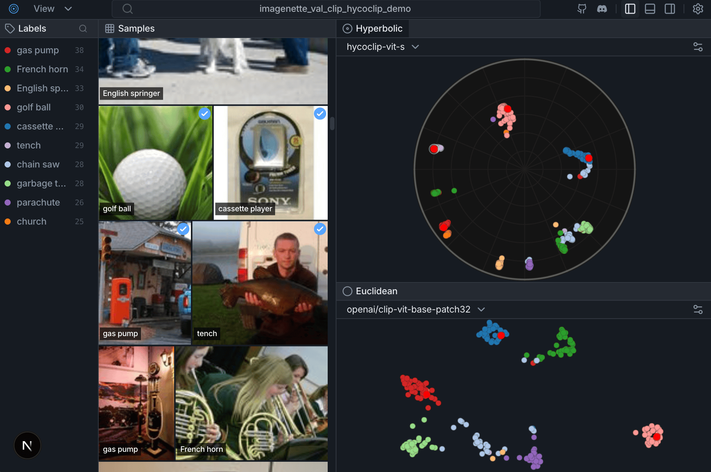

# HyperView

> **Open-source dataset curation with hyperbolic embeddings visualization**

[](https://opensource.org/licenses/MIT) [](https://deepwiki.com/HackerRoomAI/HyperView)

<p align="center">
  <a href="https://youtu.be/XLaa8FHSQtc" target="_blank">
    
  </a>
  <br>
  <a href="https://youtu.be/XLaa8FHSQtc" target="_blank">Watch the Demo Video</a>
</p>

---

## Features

- **Dual-Panel UI**: Image grid + scatter plot with bidirectional selection
- **Euclidean/Hyperbolic Toggle**: Switch between standard 2D UMAP and Poincaré disk visualization
- **HuggingFace Integration**: Load datasets directly from HuggingFace Hub
- **Fast Embeddings**: Uses EmbedAnything for CLIP-based image embeddings
- **FiftyOne-like API**: Familiar workflow for dataset exploration

## Quick Start

### Installation

```bash
git clone https://github.com/HackerRoomAI/HyperView.git
cd HyperView

# Install with uv
uv venv .venv
source .venv/bin/activate
uv pip install -e .
```

### Run the Demo

```bash
hyperview demo --samples 500
```

This will:
1. Load 500 samples from CIFAR-100
2. Compute CLIP embeddings
3. Generate Euclidean and Hyperbolic visualizations
4. Start the server at **http://127.0.0.1:6262**

### Python API

```python
import hyperview as hv

# Create dataset
dataset = hv.Dataset("my_dataset")

# Load from HuggingFace
dataset.add_from_huggingface(
    "uoft-cs/cifar100",
    split="train",
    max_samples=1000
)

# Or load from local directory
# dataset.add_images_dir("/path/to/images", label_from_folder=True)

# Compute embeddings and visualization
dataset.compute_embeddings()
dataset.compute_visualization()

# Launch the UI
hv.launch(dataset)  # Opens http://127.0.0.1:6262
```

### Google Colab

See [docs/colab.md](docs/colab.md) for a fast Colab smoke test and notebook-friendly launch behavior.

### Save and Load Datasets

```python
# Save dataset with embeddings
dataset.save("my_dataset.json")

# Load later
dataset = hv.Dataset.load("my_dataset.json")
hv.launch(dataset)
```

## Why Hyperbolic?

Traditional Euclidean embeddings struggle with hierarchical data. In Euclidean space, volume grows polynomially ($r^d$), causing **Representation Collapse** where minority classes get crushed together.

**Hyperbolic space** (Poincaré disk) has exponential volume growth ($e^r$), naturally preserving hierarchical structure and keeping rare classes distinct.

<p align="center">
  
</p>

## Architecture

```
hyperview/
├── src/hyperview/
│   ├── core/           # Dataset, Sample classes
│   ├── embeddings/     # EmbedAnything + UMAP + Poincaré projection
│   └── server/         # FastAPI + static frontend
├── frontend/           # React/Next.js (compiled to static)
└── scripts/
    └── demo.py         # Demo script
```

**Tech Stack:**
- **Backend**: Python, FastAPI, EmbedAnything, UMAP
- **Frontend**: Next.js 16, React 18, regl-scatterplot, Zustand, Tailwind CSS
- **Package Manager**: uv

## Development

### Frontend Development (with Hot Reloading)

For the best development experience, run the backend and frontend separately:

**Terminal 1 - Start the Python backend:**
```bash
# Activate your virtual environment first
source .venv/bin/activate

# Run the demo script in no-browser mode
python scripts/demo.py --samples 200 --no-browser
```
This runs the API on **http://127.0.0.1:6262**

**Terminal 2 - Start the frontend dev server:**
```bash
cd frontend
npm install  # First time only
npm run dev
```
This runs the frontend on **http://localhost:3000** with hot reloading.

Open **http://localhost:3000** in your browser. The frontend automatically proxies `/api/*` requests to the backend at port 6262 (configured in `next.config.ts`).

Now you can:
- Edit React components and see changes instantly
- Edit Python backend and restart Terminal 1
- No need to rebuild/export the frontend during development

### Export Frontend for Production

When you're ready to bundle the frontend into the Python package:

```bash
./scripts/export_frontend.sh
```

This compiles the frontend and copies it to `src/hyperview/server/static/`. After this, `hv.launch()` serves the bundled frontend directly from the Python server.

## API Endpoints

| Endpoint | Description |
|----------|-------------|
| `GET /api/dataset` | Dataset metadata (name, labels, colors) |
| `GET /api/samples` | Paginated samples with thumbnails |
| `GET /api/embeddings` | 2D coordinates (Euclidean + Hyperbolic) |
| `POST /api/selection` | Sync selection state |

## References

- [Poincaré Embeddings for Learning Hierarchical Representations](https://arxiv.org/abs/1705.08039) (Nickel & Kiela, 2017)
- [Hyperbolic Neural Networks](https://arxiv.org/abs/1805.09112) (Ganea et al., 2018)
- [FiftyOne](https://github.com/voxel51/fiftyone) - Inspiration for the UI/API design

## License

MIT License - see [LICENSE](LICENSE) for details.
