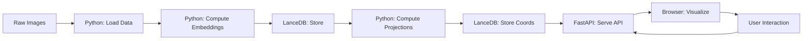

# Architecture

Learn about HyperView's system architecture and design principles.

## Overview

HyperView is built as a **three-stage pipeline** that transforms raw multimodal data into an interactive, fairness-aware visualization. Each stage uses the best tool for the job:

1. **Ingestion** – Python (PyTorch/Geoopt): Differentiable manifold operations
2. **Storage & Retrieval** – LanceDB: Fast vector storage and retrieval
3. **Visualization** – Browser (WebGL): GPU-accelerated rendering

## System Diagram


## Component Breakdown

### 1. Ingestion: Python Backend

The Python backend handles data loading, embedding computation, and projection.

**Technology Stack:**
- **FastAPI**: Web server and REST API
- **EmbedAnything**: Fast CLIP-based embeddings
- **UMAP**: Dimensionality reduction
- **PyTorch/Geoopt**: Hyperbolic geometry operations
- **LanceDB**: Vector storage

**Core Responsibilities:**

#### Data Loading
```python
# HuggingFace integration
dataset.add_from_huggingface("dataset_id", split="train")

# Local directory support
dataset.add_images_dir("/path/to/images")
```

#### Embedding Computation
```python
# High-dimensional embeddings (e.g., 512D)
dataset.compute_embeddings(model="clip")
```

Uses **EmbedAnything** for fast CLIP embeddings:
- Batch processing
- GPU acceleration (when available)
- Per-sample caching

#### Projection Pipeline

```python
dataset.compute_visualization()
```

Two-step process:

1. **Euclidean Projection**
   - UMAP reduces embeddings to 2D
   - Standard Euclidean distance metric
   - Preserves local structure

2. **Hyperbolic Projection**
   - UMAP with custom hyperbolic distance
   - Projects to Poincaré disk
   - Uses exponential map (expmap₀)
   - Preserves hierarchical structure

### 2. Storage: LanceDB

**Why LanceDB?**
- Fast vector storage
- Efficient for embeddings
- Supports incremental updates
- Good for large datasets

**Data Model:**

Each sample stores:
```python
{
    "id": "sample_001",
    "label": "cat",
    "image_path": "/path/to/image.jpg",
    "embedding": [0.1, 0.2, ...],  # 512D vector
    "euclidean_coords": [x, y],     # 2D position
    "hyperbolic_coords": [x, y]     # 2D position on Poincaré disk
}
```

**Storage Location:**
```
~/.hyperview/lancedb/
├── dataset_name/
│   ├── data/
│   ├── indices/
│   └── metadata/
```

### 3. Visualization: Frontend

The frontend provides an interactive dual-panel interface.

**Technology Stack:**
- **Next.js 16**: React framework with static export
- **React 18**: UI components
- **regl-scatterplot**: WebGL-based scatter plots
- **Zustand**: State management
- **Tailwind CSS**: Styling

**Architecture:**

#### Static Export
```bash
# Frontend is built and exported to static files
cd frontend && npm run build

# Served by FastAPI
├── src/hyperview/server/
│   └── static/
│       ├── index.html
│       ├── _next/
│       └── ...
```

#### Component Structure
```
frontend/
├── app/
│   ├── page.tsx           # Main application
│   └── layout.tsx         # Root layout
├── components/
│   ├── ImageGrid.tsx      # Left panel: image browser
│   ├── ScatterPlot.tsx    # Right panel: visualization
│   └── Controls.tsx       # View toggle, filters
└── lib/
    ├── api.ts             # API client
    └── store.ts           # State management
```

#### Rendering Pipeline

**Image Grid:**
- Pagination (50 images per page)
- Lazy loading
- Thumbnail generation on backend
- Selection highlighting

**Scatter Plot:**
- WebGL rendering via regl-scatterplot
- Handles 10,000+ points efficiently
- Color-coded by label
- Interactive selection

## Data Flow

### Complete Pipeline



### API Endpoints

| Endpoint | Method | Description |
|----------|--------|-------------|
| `/api/dataset` | GET | Dataset metadata (name, labels, colors) |
| `/api/samples` | GET | Paginated samples with thumbnails |
| `/api/embeddings` | GET | 2D coordinates (Euclidean + Hyperbolic) |
| `/api/selection` | POST | Sync selection state |
| `/api/sample/{id}/image` | GET | Full-resolution image |

### Example Request/Response

**GET /api/dataset**
```json
{
  "name": "cifar100_demo",
  "total_samples": 1000,
  "labels": ["airplane", "automobile", "bird", ...],
  "colors": {
    "airplane": "#1f77b4",
    "automobile": "#ff7f0e",
    ...
  }
}
```

**GET /api/embeddings**
```json
{
  "euclidean": [
    {"id": "sample_001", "x": 0.5, "y": -0.3, "label": "cat"},
    {"id": "sample_002", "x": -0.2, "y": 0.7, "label": "dog"},
    ...
  ],
  "hyperbolic": [
    {"id": "sample_001", "x": 0.85, "y": 0.2, "label": "cat"},
    {"id": "sample_002", "x": -0.3, "y": 0.6, "label": "dog"},
    ...
  ]
}
```

## Hyperbolic Adapter (Advanced)

For those interested in the mathematics:

### Exponential Map

The exponential map projects Euclidean vectors onto the Poincaré ball:

```python
def expmap0(v):
    """Exponential map at origin"""
    norm_v = torch.norm(v, dim=-1, keepdim=True)
    return torch.tanh(norm_v) * v / norm_v
```

This ensures all points lie within the unit disk while preserving hierarchical structure.

### Custom Distance Metric

For similarity search, we use the Poincaré distance:

```python
def poincare_distance(u, v):
    """Hyperbolic distance in Poincaré disk"""
    diff_sq = torch.sum((u - v) ** 2, dim=-1)
    u_sq = torch.sum(u ** 2, dim=-1)
    v_sq = torch.sum(v ** 2, dim=-1)
    
    return torch.arccosh(
        1 + 2 * diff_sq / ((1 - u_sq) * (1 - v_sq))
    )
```

### Möbius Transformations

For navigation (panning) in the hyperbolic view:

```python
def mobius_add(z, a):
    """Möbius addition for translation"""
    num = z + a
    den = 1 + conjugate(a) * z
    return num / den
```

This preserves hyperbolic geometry during interaction!

## Development Architecture

### Frontend Development

For development with hot reloading:

**Terminal 1 - Backend:**
```bash
source .venv/bin/activate
python scripts/demo.py --samples 200 --no-browser
# Runs on http://127.0.0.1:5151
```

**Terminal 2 - Frontend:**
```bash
cd frontend
npm run dev
# Runs on http://localhost:3000
# Proxies /api/* to backend
```

### Production Build

For deployment:

```bash
# Build frontend
cd frontend
npm run build

# Export static files
./scripts/export_frontend.sh

# Now hv.launch() serves bundled frontend
```

## Performance Considerations

### Backend

| Operation | Small Dataset | Large Dataset | Optimization |
|-----------|---------------|---------------|--------------|
| Load data | < 1s | 10-60s | Batch loading |
| Compute embeddings | 5-30s | 5-30min | GPU acceleration |
| Compute projections | 1-5s | 30-120s | UMAP parallelization |
| Serve API | < 10ms | < 50ms | LanceDB indexing |

### Frontend

| Component | Complexity | Optimization |
|-----------|------------|--------------|
| Image Grid | O(n) visible | Pagination + lazy loading |
| Scatter Plot | O(n) points | WebGL + GPU rendering |
| Selection | O(1) per click | Efficient state management |

### Scalability

**Current Limits:**
- **Samples**: Tested up to 100,000
- **Browser**: Smooth up to 10,000 points
- **Memory**: ~100MB per 10,000 samples

**Future Improvements:**
- Progressive loading for very large datasets
- Server-side filtering
- WebGL instancing for 100K+ points

## Directory Structure

```
HyperView/
├── src/hyperview/
│   ├── core/                 # Dataset, Sample classes
│   │   ├── dataset.py
│   │   └── sample.py
│   ├── embeddings/           # Embedding computation
│   │   ├── embed.py
│   │   └── projections.py
│   ├── server/               # FastAPI server
│   │   ├── app.py
│   │   ├── routes.py
│   │   └── static/           # Bundled frontend
│   ├── cli.py                # Command-line interface
│   └── __init__.py
├── frontend/                 # Next.js application
│   ├── app/
│   ├── components/
│   ├── lib/
│   └── package.json
├── scripts/
│   ├── demo.py               # Demo script
│   └── export_frontend.sh    # Build script
├── docs/                     # Documentation
├── tests/                    # Test suite
├── pyproject.toml            # Python dependencies
└── README.md
```

## Tech Stack Summary

**Backend:**
- **Language**: Python 3.10+
- **Web Framework**: FastAPI
- **Embeddings**: EmbedAnything (CLIP)
- **Dimensionality Reduction**: UMAP-learn
- **Hyperbolic Geometry**: PyTorch + Geoopt
- **Storage**: LanceDB
- **Package Manager**: uv

**Frontend:**
- **Framework**: Next.js 16 (Static Export)
- **UI Library**: React 18
- **Visualization**: regl-scatterplot (WebGL)
- **State**: Zustand
- **Styling**: Tailwind CSS
- **Build**: Turbopack

## Design Principles

1. **Simplicity**: FiftyOne-like API for familiarity
2. **Performance**: GPU acceleration where possible
3. **Persistence**: Datasets survive restarts
4. **Flexibility**: Support multiple data sources
5. **Transparency**: Both Euclidean and Hyperbolic views
6. **Interactivity**: Real-time bidirectional selection

## Next Steps

- [Understanding Hyperbolic Space](hyperbolic.md) - Learn the theory
- [Frontend Development](../development/frontend.md) - Contribute to the UI
- [Python API](../getting-started/api.md) - Use the backend
